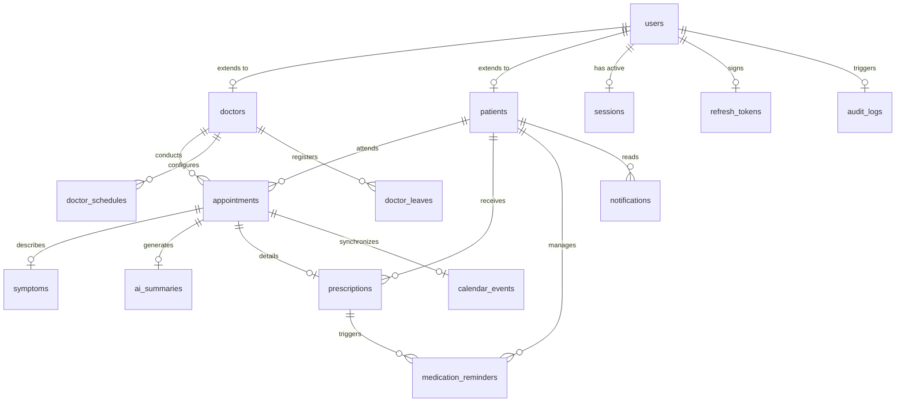

# Database Design Document
## Project: Healthcare Appointment & Follow-up Manager

This document defines the production-grade, normalized relational database design using **MySQL**. Designed from the perspective of a Senior Database Engineer, it covers schemas, keys, constraints, indexing strategies, cascade rules, soft-delete patterns, and relational models.

---

## 1. Entity-Relationship (ER) Diagram

---

## 2. Relational Schema & Tables Definition

All tables implement standard audit columns:
*   `created_at`: `DATETIME` (defaults to current timestamp).
*   `updated_at`: `DATETIME` (updates on row change).
*   `deleted_at`: `DATETIME NULL` (for soft deletes).
*   `is_deleted`: `TINYINT(1)` (default `0`).

---

### 2.1 Core Identity & Session Domain

#### Table: `users`
*   *Purpose*: The central directory storing core credentials and roles for authentication.
*   *Columns*:
    *   `id`: `VARCHAR(36)` Primary Key (UUIDv4).
    *   `email`: `VARCHAR(255)` Unique, Index.
    *   `password_hash`: `VARCHAR(255)`.
    *   `role`: `ENUM('PATIENT', 'DOCTOR', 'ADMIN')`.
    *   `mfa_secret`: `VARCHAR(128) NULL` (encrypted at rest).
    *   `mfa_enabled`: `TINYINT(1)` (default `0`).
*   *Constraints*: Check constraints to ensure email structure matches regex checks.

#### Table: `sessions`
*   *Purpose*: Tracks active user authentication state and browser logins.
*   *Columns*:
    *   `id`: `VARCHAR(36)` Primary Key.
    *   `user_id`: `VARCHAR(36)` Foreign Key -> `users(id)`.
    *   `session_token`: `VARCHAR(255)` Unique.
    *   `ip_address`: `VARCHAR(45)`.
    *   `user_agent`: `TEXT`.
    *   `expires_at`: `DATETIME`.
*   *Cascade Rules*: `ON DELETE CASCADE` (deleting a user immediately clears active sessions).

#### Table: `refresh_tokens`
*   *Purpose*: Stores active offline refresh keys.
*   *Columns*:
    *   `id`: `VARCHAR(36)` Primary Key.
    *   `user_id`: `VARCHAR(36)` Foreign Key -> `users(id)`.
    *   `token_hash`: `VARCHAR(255)` Unique.
    *   `is_revoked`: `TINYINT(1)` (default `0`).
    *   `expires_at`: `DATETIME`.
*   *Cascade Rules*: `ON DELETE CASCADE`.

---

### 2.2 Profile Domain

#### Table: `doctors`
*   *Purpose*: Stores clinical details, certifications, and specialties of doctor accounts.
*   *Columns*:
    *   `id`: `VARCHAR(36)` Primary Key (UUIDv4).
    *   `user_id`: `VARCHAR(36)` Unique, Foreign Key -> `users(id)`.
    *   `first_name`: `VARCHAR(100)`.
    *   `last_name`: `VARCHAR(100)`.
    *   `specialty`: `VARCHAR(100)` (indexed).
    *   `license_number`: `VARCHAR(50)` Unique.
    *   `google_calendar_token`: `TEXT NULL` (encrypted).
*   *Cascade Rules*: `ON DELETE RESTRICT` (prevents deletion of doctor accounts if associated clinical tables are populated).

#### Table: `patients`
*   *Purpose*: Holds patient profiles and demographic data.
*   *Columns*:
    *   `id`: `VARCHAR(36)` Primary Key.
    *   `user_id`: `VARCHAR(36)` Unique, Foreign Key -> `users(id)`.
    *   `first_name`: `VARCHAR(100)`.
    *   `last_name`: `VARCHAR(100)`.
    *   `phone_number`: `VARCHAR(20)`.
    *   `dob`: `DATE`.
    *   `medical_record_number`: `VARCHAR(50)` Unique.
*   *Cascade Rules*: `ON DELETE RESTRICT`.

---

### 2.3 Schedule & Leave Domain

#### Table: `doctor_schedules`
*   *Purpose*: Configures doctor availability rules.
*   *Columns*:
    *   `id`: `VARCHAR(36)` Primary Key.
    *   `doctor_id`: `VARCHAR(36)` Foreign Key -> `doctors(id)`.
    *   `day_of_week`: `TINYINT` (0 = Sunday, 6 = Saturday).
    *   `start_time`: `TIME`.
    *   `end_time`: `TIME`.
    *   `slot_duration_minutes`: `INT` (default `30`).
*   *Composite Keys/Unique*: Composite unique constraint on `(doctor_id, day_of_week, start_time)` prevents overlapping availability configurations.

#### Table: `doctor_leaves`
*   *Purpose*: Registers blocked schedule dates due to doctor leave requests.
*   *Columns*:
    *   `id`: `VARCHAR(36)` Primary Key.
    *   `doctor_id`: `VARCHAR(36)` Foreign Key -> `doctors(id)`.
    *   `start_date`: `DATETIME` (indexed).
    *   `end_date`: `DATETIME`.
    *   `status`: `ENUM('PENDING', 'APPROVED', 'REJECTED')`.
*   *Constraints*: Check constraint `CHECK (end_date >= start_date)`.

---

### 2.4 Appointment & Medical Domain

#### Table: `appointments`
*   *Purpose*: The central transaction ledger recording scheduled consultation details.
*   *Columns*:
    *   `id`: `VARCHAR(36)` Primary Key.
    *   `doctor_id`: `VARCHAR(36)` Foreign Key -> `doctors(id)`.
    *   `patient_id`: `VARCHAR(36)` Foreign Key -> `patients(id)`.
    *   `scheduled_start`: `DATETIME` (indexed).
    *   `scheduled_end`: `DATETIME`.
    *   `status`: `ENUM('BOOKED', 'COMPLETED', 'CANCELLED', 'NOSHOW')`.
*   *Constraints*:
    *   Unique composite index on `(doctor_id, scheduled_start)` prevents double-booking.
    *   Check constraint `CHECK (scheduled_end > scheduled_start)`.

#### Table: `symptoms`
*   *Purpose*: Captures symptoms reported by the patient during booking, including AI assessments.
*   *Columns*:
    *   `id`: `VARCHAR(36)` Primary Key.
    *   `appointment_id`: `VARCHAR(36)` Unique, Foreign Key -> `appointments(id)`.
    *   `raw_text`: `TEXT`.
    *   `parsed_symptoms`: `JSON` (parsed symptoms list).
    *   `urgency_level`: `ENUM('ROUTINE', 'URGENT', 'CRITICAL')`.
*   *Cascade Rules*: `ON DELETE CASCADE` (symptoms are deleted if the parent appointment record is purged).

#### Table: `ai_summaries`
*   *Purpose*: Stores patient-friendly summaries translated from medical notes.
*   *Columns*:
    *   `id`: `VARCHAR(36)` Primary Key.
    *   `appointment_id`: `VARCHAR(36)` Unique, Foreign Key -> `appointments(id)`.
    *   `simplified_summary`: `TEXT`.
    *   `glossary_mappings`: `JSON`.
*   *Cascade Rules*: `ON DELETE CASCADE`.

#### Table: `prescriptions`
*   *Purpose*: Clinical prescriptions issued by a doctor during an appointment.
*   *Columns*:
    *   `id`: `VARCHAR(36)` Primary Key.
    *   `appointment_id`: `VARCHAR(36)` Unique, Foreign Key -> `appointments(id)`.
    *   `patient_id`: `VARCHAR(36)` Foreign Key -> `patients(id)`.
    *   `clinical_notes`: `TEXT`.
    *   `prescribed_at`: `DATETIME`.
*   *Cascade Rules*: `ON DELETE RESTRICT`.

---

### 2.5 Notification & Integration Domain

#### Table: `medication_reminders`
*   *Purpose*: Tracks medication alerts configured for patients.
*   *Columns*:
    *   `id`: `VARCHAR(36)` Primary Key.
    *   `prescription_id`: `VARCHAR(36)` Foreign Key -> `prescriptions(id)`.
    *   `patient_id`: `VARCHAR(36)` Foreign Key -> `patients(id)`.
    *   `medication_name`: `VARCHAR(255)`.
    *   `dosage_instruction`: `VARCHAR(255)`.
    *   `frequency_cron`: `VARCHAR(50)`.
    *   `is_active`: `TINYINT(1)` (default `1`).
*   *Cascade Rules*: `ON DELETE CASCADE`.

#### Table: `notifications`
*   *Purpose*: A record of patient alerts (email, SMS, web push).
*   *Columns*:
    *   `id`: `VARCHAR(36)` Primary Key.
    *   `patient_id`: `VARCHAR(36)` Foreign Key -> `patients(id)`.
    *   `type`: `ENUM('EMAIL', 'SMS', 'PUSH')`.
    *   `subject`: `VARCHAR(255)`.
    *   `body`: `TEXT`.
    *   `is_read`: `TINYINT(1)` (default `0`).
    *   `dispatched_at`: `DATETIME`.
*   *Cascade Rules*: `ON DELETE CASCADE`.

#### Table: `calendar_events`
*   *Purpose*: Maps internal appointment bookings to external Google Calendar events.
*   *Columns*:
    *   `id`: `VARCHAR(36)` Primary Key.
    *   `appointment_id`: `VARCHAR(36)` Unique, Foreign Key -> `appointments(id)`.
    *   `google_event_id`: `VARCHAR(255)` Unique, Index.
    *   `sync_status`: `ENUM('IN_SYNC', 'PENDING', 'FAILED')`.
    *   `last_synced_at`: `DATETIME`.
*   *Cascade Rules*: `ON DELETE CASCADE`.

---

### 2.6 Audit & System Logs

#### Table: `audit_logs`
*   *Purpose*: Immutable audit trail tracking modifications to health records.
*   *Columns*:
    *   `id`: `BIGINT AUTO_INCREMENT` Primary Key (highly scalable index sequence).
    *   `user_id`: `VARCHAR(36) NULL` Foreign Key -> `users(id)` (null for anonymous/failed log-ins).
    *   `action`: `VARCHAR(50)` (e.g., `READ_PATIENT_PHI`, `MUTATE_APPOINTMENT`).
    *   `resource_identifier`: `VARCHAR(255)`.
    *   `ip_address`: `VARCHAR(45)`.
    *   `payload_diff`: `JSON` (tracks exact column changes).
    *   `logged_at`: `DATETIME` (defaults to current timestamp).
*   *Database Engine Policy*: Audit logs are strictly insert-only. Delete and update privileges on the `audit_logs` table are restricted.

---

## 3. Database Constraints & Indexing Strategy

### 3.1 Foreign Keys & Cascade Policies
*   **Identity Deletion**: Deleting from `users` cascading deletes all authentication tables (`sessions`, `refresh_tokens`).
*   **Clinical Integrity Protection**: Foreign keys referencing clinical profile records (`doctors`, `patients`, `appointments`, `prescriptions`) reject delete requests (`ON DELETE RESTRICT`). This prevents accidental deletion of historical medical files.

### 3.2 Index Architecture
1.  **Composite Index for Scheduling**:
    *   `idx_appt_doctor_time` on `appointments(doctor_id, scheduled_start)`
    *   *Why*: Speeds up doctor availability checks and prevents scheduling conflicts.
2.  **Specialty Search Index**:
    *   `idx_doc_specialty` on `doctors(specialty)`
    *   *Why*: Accelerates patient search queries.
3.  **Audit Ticker Index**:
    *   `idx_audit_time` on `audit_logs(logged_at)`
    *   *Why*: Allows administrative engines to scan recent access history efficiently.
4.  **Soft-Delete Filters**:
    *   We append `is_deleted = 0` to common lookup indexes (e.g., `idx_user_email` on `users(email, is_deleted)`).

### 3.3 Soft Delete Policy
*   We use soft deletes across patient-facing records:
    *   Updates set `is_deleted = 1` and `deleted_at = NOW()`.
    *   Lookup queries automatically append `WHERE is_deleted = 0` (handled transparently at the ORM layer in Prisma).
