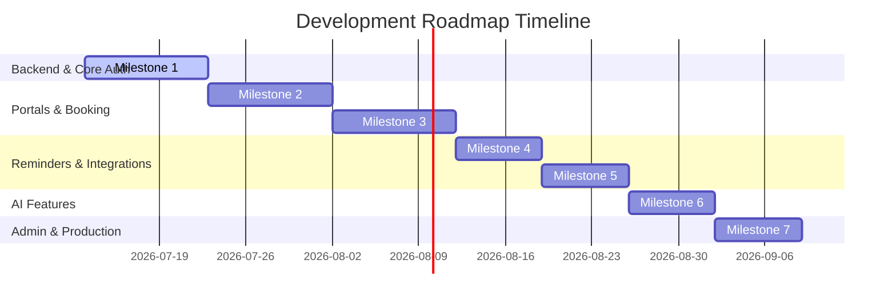

# Development Roadmap
## Project: Healthcare Appointment & Follow-up Manager

This document outlines the milestones, objectives, deliverables, dependencies, and complexity estimations for building the Healthcare Appointment & Follow-up Manager.

---

## Roadmap Overview

---

## Milestones

### Milestone 1: Foundations, Databases & Secure Authentication
*   **Objectives**: Initialize the monorepo, set up the development databases, build the user directory schema, and implement multi-factor secure authentication.
*   **Deliverables**:
    *   Initialize backend project structure with TypeScript and Express/NestJS.
    *   Initialize frontend Next.js application with CSS variables design tokens.
    *   Set up Prisma ORM with PostgreSQL and baseline schemas for Users, Profiles, and Roles.
    *   Implement user authentication endpoints (Register, Login, MFA Activation, MFA Verification).
    *   Implement Role-Based Access Control (RBAC) route guards.
*   **Dependencies**: None.
*   **Estimated Complexity**: **Medium** (Standard CRUD but high security requirements around encryption and MFA).

### Milestone 2: Patient Portal & Doctor Search
*   **Objectives**: Enable patients to browse and book available slots, manage profiles, and view their dashboard history.
*   **Deliverables**:
    *   Patient dashboard UI (React components using Vanilla CSS Modules).
    *   Doctor listing page with filtering mechanisms (specialty, ratings, slot availability).
    *   Booking transaction logic with race-condition prevention (pessimistic locking of database slots).
    *   Patient appointment cancel/reschedule backend endpoints and UI dashboards.
*   **Dependencies**: Milestone 1 (Requires user identity, roles, and session structures).
*   **Estimated Complexity**: **High** (Complexity centers on handling database transaction locks and race conditions on simultaneous booking requests).

### Milestone 3: Doctor Portal & Schedule/Leave Management
*   **Objectives**: Allow doctors to configure availability patterns, process leaves, and manage consultations.
*   **Deliverables**:
    *   Doctor dashboard UI showing today's patient list.
    *   Schedule availability setup page (setting daily hours, duration intervals, break periods).
    *   Leave/Emergency blockout submission interface.
    *   Automated cancel-and-notify handler triggered upon leave approval (queues rescheduling alerts for affected patients).
*   **Dependencies**: Milestone 2 (Relies on appointment structures created in booking module).
*   **Estimated Complexity**: **High** (Dynamic availability slot algorithms and automatic leave conflict resolution logic).

### Milestone 4: Notification Queue & Medication Reminders
*   **Objectives**: Set up a durable background queue for system transactions and medication alerts.
*   **Deliverables**:
    *   Redis container configuration and connection management wrappers.
    *   BullMQ scheduler backend engine.
    *   Medication Schedule Engine (parsing custom frequencies like "twice daily" into precise CRON-like BullMQ jobs).
    *   HTML email templates and SendGrid/SES worker integrations.
    *   Web push notification server and patient consent handlers.
*   **Dependencies**: Milestone 2 (Needs booking and user records to trigger messages).
*   **Estimated Complexity**: **Medium** (Queue management, retry policies, and handling user time zones in reminders).

### Milestone 5: Google Calendar Sync Engine
*   **Objectives**: Enable offline, bidirectional synchronization of calendar entries with Google Calendar.
*   **Deliverables**:
    *   OAuth2 flow for users to consent to Google Calendar scopes.
    *   Sync job listener (detects booking/cancellation events and updates calendar resources).
    *   Incoming Webhook receiver for Google Calendar push notifications (updates database if doctor marks a blockout in their external Google Calendar).
    *   Conflict resolver (prioritizes internal system state while keeping external systems synchronized).
*   **Dependencies**: Milestone 3 (Requires calendar structure and doctor availability schemas).
*   **Estimated Complexity**: **High** (Handling Google OAuth token refreshes, sync errors, and bidirectional loops).

### Milestone 6: AI-Powered Insights & Summaries
*   **Objectives**: Incorporate LLM services safely and cost-effectively to support patient symptom profiling and clinical translation.
*   **Deliverables**:
    *   Symptom analyzer workflow (structured chat interface routing to a fine-tuned prompt evaluating triage urgency levels).
    *   De-identification (PII/PHI filter) utility running locally before sending records to external LLMs.
    *   AI translation worker that creates patient-friendly summaries from doctor clinical notes.
    *   Redis-based prompt response cache to save recurring API costs.
*   **Dependencies**: Milestone 3 & Milestone 4 (Needs clinical notes from consultations and notifications to alert patients of summaries).
*   **Estimated Complexity**: **Medium** (Prompt engineering, output parsing, schema compliance, and local HIPAA-compliant filtering).

### Milestone 7: Admin Panel, Audit Logging & Production Hardening
*   **Objectives**: Provide system administrators with analytic controls, secure database auditing, and deploy infrastructure via CI/CD.
*   **Deliverables**:
    *   Analytics engine aggregation scripts running against database replicas.
    *   Immutable Audit Trail database schemas utilizing PostgreSQL partitions and write-once privileges.
    *   Admin user provisioning interface.
    *   Terraform infrastructure configurations (AWS ECS/RDS/Elasticache).
    *   GitHub Actions CI/CD workflows for building docker images and running E2E test suites.
*   **Dependencies**: Milestone 1 through 6.
*   **Estimated Complexity**: **Medium** (Deploy scripts, dashboard integrations, and securing audit logs).
