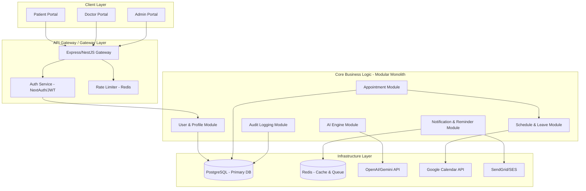

# Software Architecture Document (SAD)
## Project: Healthcare Appointment & Follow-up Manager

This document outlines the software architecture, system design, and technical decisions for the **Healthcare Appointment & Follow-up Manager**, a production-grade SaaS product designed for scalable, secure, and compliant healthcare management.

---

## 1. Functional Requirements

The application is split across three main workflows: Patient, Doctor, and Administrative.

### 1.1 Patient Portal
*   **Authentication & Profile**: Patients can securely register, complete MFA, and manage their health profiles, emergency contacts, and insurance details.
*   **Appointment Booking**: 
    *   Search for doctors by specialty, availability, and rating.
    *   Book, reschedule, or cancel appointments.
    *   Sync appointments to personal calendars (Google Calendar).
*   **AI Symptom Analyzer**: Input symptoms via a structured chat interface and receive a non-diagnostic assessment of potential urgency level and suggested specialties.
*   **AI Patient-Friendly Summary**: View simplified, jargon-free translations of doctor notes, prescriptions, and diagnosis summaries.
*   **Medication Reminders**: Receive real-time alerts (email/SMS/web push) for medication schedules.
*   **Follow-up Tracking**: Track scheduled follow-ups and view timeline visualisations of care paths.

### 1.2 Doctor Portal
*   **Schedule Management**: 
    *   Set working hours, slot durations, and buffer times.
    *   Mark slot availabilities as virtual (telehealth) or in-person.
*   **Leave Management**: Request leaves or block out emergency hours, automatically triggering rescheduling flows for affected patients.
*   **Patient Records & Consultations**:
    *   Access patient medical history before/during consultations.
    *   Input clinical notes, prescriptions, and follow-up directives.
*   **AI Scribe Assistance**: Draft clinical notes from bulleted session outcomes.

### 1.3 Admin Portal
*   **User Management**: Provision doctor accounts, manage staff permissions, and verify patient registrations.
*   **System Auditing**: Monitor immutable system logs tracking all data mutations (HIPAA compliance requirement).
*   **Analytics Dashboard**: View system-wide metrics (appointment volumes, active patients, doctor load, cancellation rates, AI API costs).
*   **Configuration Control**: Manage global settings (symptom analysis thresholds, email templates, slot intervals).

---

## 2. Non-Functional Requirements

### 2.1 Security & Compliance (HIPAA, GDPR)
*   **Data Encryption**: AES-256 for data at rest (specifically database columns containing PHI/PII); TLS 1.3 for data in transit.
*   **Access Control**: Role-Based Access Control (RBAC) enforced at both API gateway and database levels (PostgreSQL Row-Level Security).
*   **Auditability**: Strict tracking of read/write operations on Patient Health Information (PHI).

### 2.2 Performance & Availability
*   **Latency**: API response time under 200ms for p95, excluding complex LLM generations.
*   **Uptime**: 99.9% availability target (Multi-AZ deployment).
*   **Concurrency**: Support up to 500 concurrent active transactions without performance degradation.

### 2.3 Reliability & Resiliency
*   **Queue Durability**: Zero-loss background queues (BullMQ + Redis) for notifications and reminders.
*   **Fault Tolerance**: Graceful degradation when external services (e.g., OpenAI, Google Calendar) are unavailable.

---

## 3. User Roles & Access Matrix

The system enforces strict authorization mapping:

| Module / Feature | Guest | Patient | Doctor | Admin |
| :--- | :---: | :---: | :---: | :---: |
| Self-Registration / MFA Setup | ✔ | ✔ | ✗ | ✗ |
| Search Doctors & Book | ✗ | ✔ | ✗ | ✗ |
| View Self Medical History | ✗ | ✔ | ✔ | ✗ |
| Edit Self Profile / Preferences | ✗ | ✔ | ✔ | ✔ |
| Input Consult Notes / Prescriptions | ✗ | ✗ | ✔ | ✗ |
| Manage Schedule / Leaves | ✗ | ✗ | ✔ | ✗ |
| View System Analytics & Logs | ✗ | ✗ | ✗ | ✔ |
| Verify Credentials & User Provisioning | ✗ | ✗ | ✗ | ✔ |
| View Immutable Access Logs | ✗ | ✗ | ✗ | ✔ |

---

## 4. Complete Feature List

1.  **Secure Authentication**: OAuth2/OIDC, passwordless OTP options, Google Log-in, TOTP-based Multi-Factor Authentication (MFA).
2.  **Interactive Booking System**: Real-time calendar slot search, race-condition mitigation (double-booking protection via database serialization locks), automated Google Calendar invite creation.
3.  **Leave & Blockout Workflow**: Doctor leave requests automatically trigger a background job to identify conflicts, notify patients, and suggest auto-rescheduling links.
4.  **AI Symptom Parser**: Guided symptom profiling with risk classification (Urgent, Routine, Preventive) and recommendation matching.
5.  **AI Translation Engine**: Parses complex clinical records (ICD-10 codes, medical terminology) into an 8th-grade reading level patient-friendly summary.
6.  **Medication Reminder Queue**: User-configured intervals (e.g., "twice daily after meals") translated to CRON entries in BullMQ, firing push notifications and email reminders.
7.  **Google Calendar Bidirectional Sync**: Offline sync engine updating doctor/patient availability based on external calendar events using Google Calendar Webhooks.
8.  **Operational Analytics**: Metrics engine parsing session logs to compile real-time load analytics, average booking-to-visit delay, and retention rates.
9.  **Immutable Audit Logger**: Separate database schema storing write-once records tracking user actions, IP addresses, resource modified, and access tokens used.

---

## 5. Project Modules



---

## 6. Architecture Style: Modular Monolith

To support rapid validation and low infrastructure overhead during the initial launch, while laying a robust path to microservices, we will implement a **Modular Monolith** architecture.

### Why Modular Monolith?
*   **Separation of Concerns**: Modules communicate via strictly defined programmatic interfaces (Internal Service contracts), ensuring code separation.
*   **Shared DB with Schema Isolation**: Modules reference separate database tables/schemas. Direct joins across domains (e.g., joining an `AuditLog` to a `PatientRecord` directly) are forbidden; dependencies are resolved at the service layer.
*   **Smooth Microservices Migration**: If the `AI Engine Module` or the `Notification Module` scales exponentially, it can be carved out into a separate AWS Lambda or Docker container with minimal refactoring.

---

## 7. Communication Between Modules

*   **Synchronous Inter-Module calls**: Performed via dependency injection of service interfaces. For example, [AppointmentService](file:///s:/Assignment_Unthinkable/backend/src/modules/appointment/appointment.service.ts) calls [ScheduleService](file:///s:/Assignment_Unthinkable/backend/src/modules/schedule/schedule.service.ts) using typed function calls.
*   **Asynchronous Event-Driven Communication**: For decoupling non-blocking transactions (e.g., an appointment creation triggers email sending and calendar sync), we use an in-process Event Emitter (`EventEmitter2` in Node.js).
    *   *Example Event*: `appointment.booked` is emitted.
    *   *Listeners*: `GoogleCalendarListener` catches the event to create an invite, and `NotificationListener` catches it to queue an email.

---

## 8. Directory Structure & Folder Responsibilities

We organize the project into a monorepo containing `frontend` and `backend` codebases.

```
s:/Assignment_Unthinkable/
├── backend/                             # Express / NestJS TypeScript Backend
│   ├── src/
│   │   ├── config/                      # Database, Redis, and API configs
│   │   ├── common/                      # Middlewares, guards, utilities, decorators
│   │   │   ├── filters/                 # Global Exception Filters
│   │   │   ├── guards/                  # RBAC and Auth Guards
│   │   │   └── interceptors/            # Logging and response formatting interceptors
│   │   ├── database/                    # Prisma schema, migrations, seed scripts
│   │   └── modules/                     # Encapsulated Business Modules
│   │       ├── auth/                    # Auth, MFA, Session management
│   │       ├── user/                    # Profiles, doctor details, patients
│   │       ├── appointment/             # Booking engines, slot generation, locking
│   │       ├── schedule/                # Doctor availability, leaves, calendar sync
│   │       ├── ai/                      # OpenAI/Gemini integration, PII scrubbers
│   │       ├── notification/            # Email templates, BullMQ job processors
│   │       └── audit/                   # Immutable event tracker
│   │   ├── app.module.ts                # Application root module
│   │   └── main.ts                      # App entry point
│   ├── test/                            # Integration and E2E tests
│   ├── package.json
│   └── tsconfig.json
│
├── frontend/                            # Next.js 14 Web Portal (App Router)
│   ├── public/                          # Static assets
│   ├── src/
│   │   ├── app/                         # App Router Pages
│   │   │   ├── (auth)/                  # Auth group (Login, Register, MFA)
│   │   │   ├── (patient)/               # Patient Dashboard pages
│   │   │   ├── (doctor)/                # Doctor Dashboard pages
│   │   │   ├── (admin)/                 # Admin Dashboard pages
│   │   │   └── layout.tsx               # Root layout
│   │   ├── components/                  # Reusable UI Components
│   │   │   ├── ui/                      # Design system atoms (buttons, inputs)
│   │   │   ├── charts/                  # Analytics components
│   │   │   └── shared/                  # Common templates (Navbar, Sidebar)
│   │   ├── hooks/                       # Custom React hooks
│   │   ├── services/                    # API wrappers (fetch client)
│   │   ├── styles/                      # Vanilla CSS (CSS Modules)
│   │   │   ├── variables.css            # Global CSS tokens (Colors, Typography)
│   │   │   └── globals.css              # Reset and base styles
│   │   └── utils/                       # Date parsers, formatting utilities
│   ├── package.json
│   └── tsconfig.json
```

---

## 9. Scalability Strategy

To handle enterprise-scale traffic, we employ the following layers:

1.  **Horizontal Scalability**: Stateless API containers deployed to AWS ECS/Fargate behind an Application Load Balancer (ALB).
2.  **Database Connection Pooling**: pgBouncer utilized to prevent PostgreSQL thread starvation under heavy connection volume.
3.  **Read-Write Separation**: PostgreSQL primary instance manages writes, while read requests (e.g., patient viewing dashboards) query read replicas.
4.  **Distributed Caching**: Redis caches active doctor schedules and slot availabilities. Cache invalidation occurs whenever a booking, cancellation, or leave is registered.
5.  **Race Condition Prevention**: Optimistic locking in PostgreSQL database transaction layers prevents double-booking the exact same doctor slot.

---

## 10. Security Strategy

Healthcare apps demand defense-in-depth:

*   **PII & PHI Protection**: Encrypt columns containing medical notes, diagnosis, and patient phone numbers at the database layer using Postgres `pgcrypto` or application-level encryption keys.
*   **Row-Level Security (RLS)**: Enforced via PostgreSQL RLS policies ensuring a doctor can only read records of patients they have scheduled appointments with, and patients can only read their own records.
*   **MFA Escalation**: High-privilege tasks (like exporting medical history or modifying administrative system configs) trigger step-up authentication.
*   **Token Security**: HttpOnly, Secure, SameSite=Strict cookies to store JWT tokens, preventing XSS-based token theft.
*   **API Rate Limiting**: Redis-backed sliding window rate limiter to prevent DDoS attacks on login and symptom-check endpoints.

---

## 11. Error Handling Strategy

1.  **Unified Error Hierarchy**: A base class `AppException` extends `Error`. Domain exceptions (e.g., `AppointmentConflictException`, `UnauthorizedRoleException`) extend `AppException` with unique error codes.
2.  **Global Exception Filter**: Express/NestJS middleware catches unhandled exceptions, logs them with stack traces (excluding sensitive data), and maps them to clean HTTP responses:
    ```json
    {
      "statusCode": 409,
      "errorCode": "ERR_APPOINTMENT_CONFLICT",
      "message": "The selected appointment slot has already been booked.",
      "timestamp": "2026-07-12T14:08:03Z"
    }
    ```
3.  **Client-Side Resilience**: Frontend error boundaries catch rendering errors. API wrapper handles network issues with exponential backoff retries.

---

## 12. Logging Strategy

*   **Two-Track Logging**:
    1.  **Application Logs**: Informational, debug, and system errors logged via Winston to stdout. Formatted in structured JSON.
    2.  **Audit Logs**: Compliance-mandated record of access. Every creation, retrieval, modification, or deletion of patient health records (PHI) is written to a dedicated Postgres partition or immutable database table.
*   **Format**: Application logs must not contain PII/PHI.
    *   *Allowed*: User ID, Action, Timestamp, Correlation ID.
    *   *Forbidden*: Patient Name, Symptoms, Medical Notes, SSN.

---

## 13. AI Integration Strategy

We integrate AI using a secure, performant gateway pattern:

*   **PII/PHI Anonymization**: Before sending clinical text to public LLM APIs (OpenAI/Gemini), a local regex/NLP filter strips names, emails, and phone numbers.
*   **Structured Output (JSON Mode)**: All LLM prompts require strict schema enforcement (using JSON schemas/Instructor libraries) to ensure parsing reliability.
*   **Caching Engine**: Common symptom queries and non-individual evaluations are cached in Redis to control API costs and response latency.
*   **Asynchronous summarization**: Patient summaries are generated in a background job upon appointment completion, minimizing primary thread delay.

---

## 14. Notification & Reminder Strategy

Reminders and notifications require bulletproof delivery queues:

```
[Booking Event] ──> [Queue Job Created] ──> [BullMQ (Redis)]
                                                 │
                                                 ├──> [Worker: Email Service] ──> SendGrid/SES
                                                 └──> [Worker: Push Service]  ──> WebPush/SMS
```

*   **Retry Mechanisms**: Automatic exponential backoff with a maximum of 5 retries for external email/SMS providers.
*   **Preference Matrix**: Users can specify preferred channels (Email, SMS, or Push Notifications) for both promotional announcements and critical medical reminders.

---

## 15. Deployment Strategy

*   **Infrastructure as Code (IaC)**: Terraform scripts defining the AWS network topology, RDS instances, ECS clusters, and Redis instances.
*   **CI/CD Pipeline**: GitHub Actions running linting, formatting, test suites, building docker images, pushing them to AWS ECR, and executing rolling deployments to ECS.
*   **Database Migrations**: Integrated into the deployment pipeline; migrations run inside a container task before application startup to ensure database schema synchronicity.
